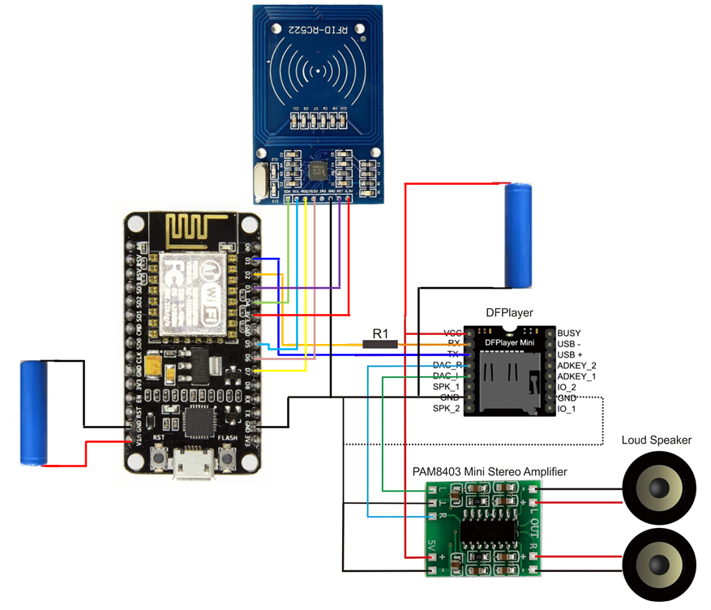
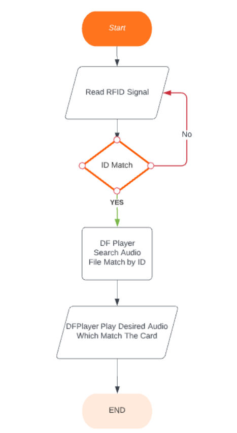
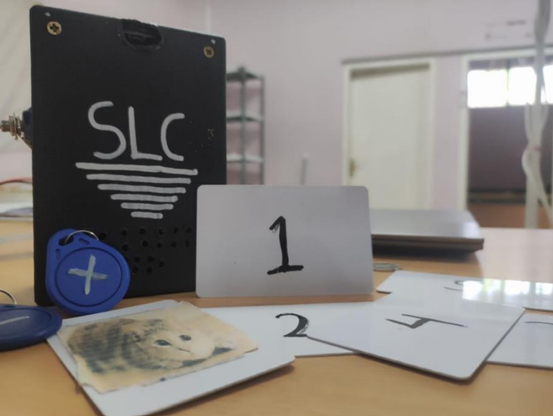

# Self Learning Cube (SLC) - Final Project Embedded System Universitas Sultan Ageng Tirtayasa

## Description
This porject using RFID Reader RC522 to identify RFID Card that has an image on it, then the ID will be forwardded to the ESP8266 to identify what the picture is and then make a sound to describe the picture. This project can also perform arithmetic operations to help children learnning mathematics by its self.

## How to Use
Put the SLC on the card that has an image on it and the SLC will make a sound to describe whats the image or you can put the SLC on the card that has a number on it and then put the SLC on the card that has an operation aritmathics also. You can see the demo on the link bellow.

## Hardware Device
* ESP8266
* RFID Reader RC522
* 2x Batery 18650
* DF Player Mini
* PAM8403
* 2x Loud Speaker

## Wiring Diagram

## Flow System

## Demo
Link Demo : https://youtu.be/5TYQNCkU2wc

****************************************************

**Author:** 
Andi Saputra 3332190032  
Arif Alfian 3332190055 
Andre Januar 3332190096

Created Juni 2022
